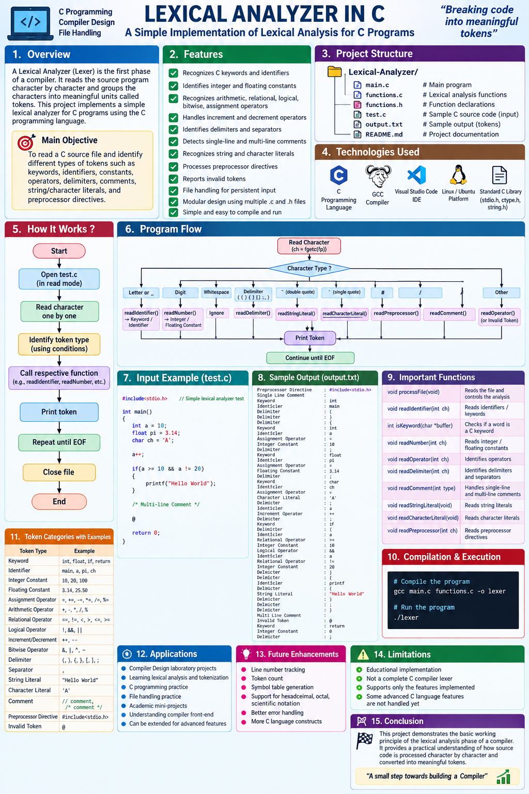

# 🔍 Lexical Analyzer in C

A simple and modular **Lexical Analyzer implemented in C**. The project reads a C source file character by character and identifies different types of tokens such as keywords, identifiers, constants, operators, delimiters, comments, literals, preprocessor directives, and invalid tokens.


<p align="center">
  
</p>


## 📌 Overview

Lexical analysis is the **first phase of a compiler**. It reads the source program and divides it into meaningful units called **tokens**.

This project implements a basic lexical analyzer for C programs using the C programming language.

The analyzer reads the input source file:

```text
test.c
```

and identifies tokens such as:

- Keywords
- Identifiers
- Integer Constants
- Floating Constants
- Assignment Operators
- Arithmetic Operators
- Relational Operators
- Logical Operators
- Bitwise Operators
- Increment and Decrement Operators
- Delimiters
- Comments
- String Literals
- Character Literals
- Preprocessor Directives
- Invalid Tokens

---

## 🎯 Objectives

The main objectives of this project are:

- To understand lexical analysis.
- To understand how tokens are identified.
- To read a C source file character by character.
- To identify keywords and identifiers.
- To identify integer and floating-point constants.
- To identify different types of operators.
- To identify delimiters and separators.
- To identify single-line and multi-line comments.
- To identify string and character literals.
- To identify preprocessor directives.
- To detect invalid tokens.
- To practice file handling in C.
- To practice modular programming using `.c` and `.h` files.

---

## ✨ Features

### 🔑 Keyword Recognition

The analyzer identifies C keywords such as:

```text
auto
break
case
char
const
continue
default
do
double
else
enum
extern
float
for
goto
if
int
long
register
return
short
signed
sizeof
static
struct
switch
typedef
union
unsigned
void
volatile
while
```

Example:

```c
int main()
```

Output:

```text
Keyword                   : int
Identifier                : main
```

---

### 🔤 Identifier Recognition

The analyzer recognizes identifiers containing letters, digits, and underscores.

Example:

```c
int number = 10;
```

Output:

```text
Keyword                   : int
Identifier                : number
Assignment Operator       : =
Integer Constant          : 10
Delimiter                 : ;
```

---

### 🔢 Integer Constants

Integer values are identified as integer constants.

Example:

```c
int a = 10;
```

Output:

```text
Integer Constant          : 10
```

---

### 🔢 Floating Constants

Floating-point values are identified separately.

Example:

```c
float pi = 3.14;
```

Output:

```text
Floating Constant         : 3.14
```

---

### ➕ Arithmetic Operators

The analyzer recognizes:

```text
+
-
*
/
%
```

Example:

```c
a + b
```

Output:

```text
Identifier                : a
Arithmetic Operator       : +
Identifier                : b
```

---

### 📝 Assignment Operators

Supported assignment operators include:

```text
=
+=
-=
*=
/=
%=
```

Example:

```c
a = 10;
```

Output:

```text
Identifier                : a
Assignment Operator       : =
Integer Constant          : 10
Delimiter                 : ;
```

---

### ⚖️ Relational Operators

Supported relational operators include:

```text
==
!=
<
>
<=
>=
```

Example:

```c
a >= 10
```

Output:

```text
Identifier                : a
Relational Operator       : >=
Integer Constant          : 10
```

---

### 🧠 Logical Operators

Supported logical operators:

```text
!
&&
||
```

Example:

```c
a >= 10 && a != 20
```

Output:

```text
Identifier                : a
Relational Operator       : >=
Integer Constant          : 10
Logical Operator          : &&
Identifier                : a
Relational Operator       : !=
Integer Constant          : 20
```

---

### 🔄 Increment and Decrement Operators

The analyzer recognizes:

```text
++
--
```

Example:

```c
a++;
```

Output:

```text
Identifier                : a
Increment Operator        : ++
Delimiter                 : ;
```

---

### 🔀 Bitwise Operators

Supported bitwise operators:

```text
&
|
^
~
```

---

### 🔣 Delimiters and Separators

The analyzer recognizes:

```text
(
)
{
}
[
]
;
,
```

Example:

```c
main()
{
}
```

Output:

```text
Identifier                : main
Delimiter                 : (
Delimiter                 : )
Delimiter                 : {
Delimiter                 : }
```

---

### 💬 Comments

The analyzer supports both C comment types.

#### Single-Line Comment

```c
// This is a single-line comment
```

Output:

```text
Single Line Comment       :
```

#### Multi-Line Comment

```c
/*
   This is a
   multi-line comment
*/
```

Output:

```text
Multi Line Comment        :
```

If a multi-line comment is not closed properly, the analyzer reports an error.

---

### 📝 String Literals

Strings enclosed within double quotes are recognized.

Example:

```c
printf("Hello World");
```

Output:

```text
Identifier                : printf
Delimiter                 : (
String Literal            : "Hello World"
Delimiter                 : )
Delimiter                 : ;
```

---

### 🔤 Character Literals

Characters enclosed within single quotes are recognized.

Example:

```c
char ch = 'A';
```

Output:

```text
Keyword                   : char
Identifier                : ch
Assignment Operator       : =
Character Literal         : 'A'
Delimiter                 : ;
```

---

### #️⃣ Preprocessor Directives

The analyzer recognizes preprocessor directives beginning with `#`.

Example:

```c
#include<stdio.h>
```

Output:

```text
Preprocessor Directive    : #include<stdio.h>
```

---

### ❌ Invalid Tokens

Characters that are not recognized as valid tokens are reported as invalid tokens.

Example:

```c
@
```

Output:

```text
Invalid Token             : @
```

---

# 📂 Project Structure

```text
Lexical-Analyzer/
│
├── main.c
├── functions.c
├── functions.h
├── test.c
├── output.txt
└── README.md
```

---

## 📄 File Description

| File | Description |
|---|---|
| `main.c` | Main entry point of the program |
| `functions.c` | Contains the implementation of lexical analyzer functions |
| `functions.h` | Contains function declarations |
| `test.c` | Sample C source file used as input |
| `output.txt` | Sample tokenized output |
| `README.md` | Project documentation |

---

# 🏗️ Program Architecture

```text
                 ┌──────────────────┐
                 │     test.c       │
                 │   C Source Code  │
                 └────────┬─────────┘
                          │
                          ▼
                 ┌──────────────────┐
                 │     main.c       │
                 │  Open Input File │
                 └────────┬─────────┘
                          │
                          ▼
                 ┌──────────────────┐
                 │  processFile()   │
                 │ Read Characters   │
                 └────────┬─────────┘
                          │
            ┌─────────────┼─────────────┐
            │             │             │
            ▼             ▼             ▼
       Identifier       Number       Operator
            │             │             │
            ▼             ▼             ▼
        Keyword        Constant      Operator
            │
            ├──────────────┐
            │              │
            ▼              ▼
       Delimiter        Comment
            │              │
            ├──────────────┤
            │              │
            ▼              ▼
    String Literal   Character Literal
            │
            ▼
   Preprocessor Directive
            │
            ▼
      Invalid Token
            │
            ▼
       Token Output
```

---

# ⚙️ How the Program Works

The program starts execution from `main()`.

The `main()` function opens the input file:

```text
test.c
```

in read mode.

It then calls:

```c
processFile();
```

The `processFile()` function reads the file one character at a time and determines the type of token.

After processing is completed, the file is closed.

---

# 🔄 Lexical Analysis Flow

```text
             Read Character
                   │
                   ▼
          Identify Character
                   │
       ┌───────────┼────────────┐
       │           │            │
       ▼           ▼            ▼
     Letter       Digit       Symbol
       │           │            │
       ▼           ▼            ▼
 Identifier      Number      Operator /
       │         Constant     Delimiter
       ▼
 Keyword /
 Identifier

       ┌──────────────────────────┐
       │                          │
       ▼                          ▼
      '"'                        '\''
       │                          │
       ▼                          ▼
 String Literal           Character Literal

       ┌──────────────────────────┐
       │                          │
       ▼                          ▼
      '#'                        '/'
       │                          │
       ▼                          ▼
 Preprocessor              Comment /
 Directive                 Division

                   │
                   ▼
             Token Output
```

---

# 🧩 Important Functions

## `processFile()`

Reads the input file character by character and determines which lexical analysis function should process the current character.

```c
void processFile(void);
```

---

## `readIdentifier()`

Reads an identifier or keyword from the source file.

```c
void readIdentifier(int ch);
```

---

## `isKeyword()`

Checks whether a word is a C keyword.

```c
int isKeyword(char *buffer);
```

Return values:

```text
1 → Keyword
0 → Identifier
```

---

## `readNumber()`

Reads integer and floating-point constants.

```c
void readNumber(int ch);
```

---

## `readOperator()`

Identifies different types of operators.

```c
void readOperator(int ch);
```

Examples:

```text
=
==
+
++
-
--
>=
<=
!=
&&
||
+=
-=
*=
/=
%=
```

---

## `readDelimiter()`

Identifies delimiters and separators.

```c
void readDelimiter(int ch);
```

---

## `readComment()`

Processes single-line and multi-line comments.

```c
void readComment(int type);
```

---

## `readStringLiteral()`

Reads a string enclosed within double quotes.

```c
void readStringLiteral(void);
```

---

## `readCharacterLiteral()`

Reads a character enclosed within single quotes.

```c
void readCharacterLiteral(void);
```

---

## `readPreprocessor()`

Reads a complete preprocessor directive.

```c
void readPreprocessor(int ch);
```

---

# 📜 Sample Input

The project uses a C source file similar to the following for testing:

```c
#include<stdio.h>                            // Simple lexical analyzer test

int main()
{
    int a = 10;
    float pi = 3.14;
    char ch = 'A';

    a++;

    if(a >= 10 && a != 20)
    {
        printf("Hello World");
    }

    /* Multi-line Comment */

    @

    return 0;
}
```

---

# 📤 Sample Output

The analyzer produces tokenized output similar to:

```text
Preprocessor Directive    : #include<stdio.h>
Single Line Comment       :
Keyword                   : int
Identifier                : main
Delimiter                 : (
Delimiter                 : )
Delimiter                 : {
Keyword                   : int
Identifier                : a
Assignment Operator       : =
Integer Constant          : 10
Delimiter                 : ;
Keyword                   : float
Identifier                : pi
Assignment Operator       : =
Floating Constant         : 3.14
Delimiter                 : ;
Keyword                   : char
Identifier                : ch
Assignment Operator       : =
Character Literal         : 'A'
Delimiter                 : ;
Identifier                : a
Increment Operator        : ++
Delimiter                 : ;
Keyword                   : if
Delimiter                 : (
Identifier                : a
Relational Operator       : >=
Integer Constant          : 10
Logical Operator          : &&
Identifier                : a
Relational Operator       : !=
Integer Constant          : 20
Delimiter                 : )
Delimiter                 : {
Identifier                : printf
Delimiter                 : (
String Literal            : "Hello World"
Delimiter                 : )
Delimiter                 : ;
Delimiter                 : }
Multi Line Comment        :
Invalid Token             : @
Keyword                   : return
Integer Constant          : 0
Delimiter                 : ;
Delimiter                 : }
```

---

# 🛠️ Technologies Used

| Technology | Purpose |
|---|---|
| C | Programming Language |
| GCC | Compiler |
| Visual Studio Code | Development Environment |
| Linux / Ubuntu / WSL | Execution Environment |
| Standard C Library | File and character processing |

---

# 📚 Libraries Used

The project uses the following standard C libraries.

### `stdio.h`

Used for:

- File handling
- Input/output
- `FILE`
- `fopen()`
- `fgetc()`
- `fclose()`
- `ungetc()`
- `printf()`

### `ctype.h`

Used for character classification:

```c
isalpha()
isdigit()
isalnum()
isspace()
```

### `string.h`

Used for string comparison:

```c
strcmp()
```

---

# 🔨 Compilation

Open a terminal inside the project directory.

Compile the program using:

```bash
gcc main.c functions.c -o lexer
```

If compilation is successful, an executable named `lexer` will be generated.

---

# ▶️ Running the Program

Run the executable using:

```bash
./lexer
```

The program reads:

```text
test.c
```

and displays the recognized tokens in the terminal.

---

# 🖥️ Running in VS Code

Open the project folder in Visual Studio Code.

Open the integrated terminal:

```text
Terminal → New Terminal
```

Compile:

```bash
gcc main.c functions.c -o lexer
```

Run:

```bash
./lexer
```

---

# 🧪 Testing

To test the lexical analyzer, modify `test.c`.

For example:

```c
int x = 100;
float value = 25.50;
char grade = 'A';

if(x >= 50)
{
    printf("Pass");
}
```

Compile and run again:

```bash
gcc main.c functions.c -o lexer
./lexer
```

The program will identify the tokens from the updated source file.

---

# 🧠 Concepts Demonstrated

This project demonstrates important concepts in:

## Compiler Design

- Lexical Analysis
- Tokenization
- Token Classification
- Keyword Recognition
- Lexical Error Detection

## C Programming

- Functions
- Arrays
- Strings
- Pointers
- Header Files
- Conditional Statements
- Loops
- Switch Statements
- Modular Programming

## File Handling

The project uses:

```c
fopen()
fgetc()
fclose()
ungetc()
```

for reading and processing the source file.

## Character Processing

The project uses:

```c
isalpha()
isdigit()
isalnum()
isspace()
```

for character classification.

## String Processing

The project uses:

```c
strcmp()
```

to compare identifiers with the list of C keywords.

---

# 🧱 Modular Design

The project is divided into multiple source files.

```text
main.c
   │
   ├── Opens test.c
   │
   ├── Calls processFile()
   │
   └── Closes test.c
          │
          ▼
     functions.c
          │
          ├── processFile()
          ├── readIdentifier()
          ├── isKeyword()
          ├── readNumber()
          ├── readOperator()
          ├── readDelimiter()
          ├── readComment()
          ├── readStringLiteral()
          ├── readCharacterLiteral()
          └── readPreprocessor()
```

The function declarations are stored in:

```text
functions.h
```

---

# ⚠️ Limitations

This is an educational implementation of a lexical analyzer and is not intended to replace a complete C compiler lexer.

The analyzer supports the token types implemented in the current source code.

Some advanced C language features are not currently handled.

Possible extensions include:

- Escape sequences
- Hexadecimal constants
- Octal constants
- Scientific notation
- Advanced character literals
- Advanced string validation
- Line number tracking
- Token counting
- Symbol table generation
- Additional C operators
- Improved lexical error handling

---

# 🚀 Future Enhancements

The project can be extended with the following features.

### 1. Line Number Tracking

Display the source line for each token.

Example:

```text
Line 4 : Keyword : int
Line 4 : Identifier : a
```

### 2. Token Count

Display the total number of tokens.

```text
Total Tokens : 25
```

### 3. Symbol Table

Generate a symbol table containing identifiers.

```text
Identifier       Type
----------------------
a                int
pi               float
ch               char
```

### 4. Improved Error Handling

Display detailed lexical errors.

```text
Invalid Number
Unterminated Comment
Unterminated String Literal
Invalid Character Literal
Invalid Token
```

### 5. Additional Number Formats

Support additional numeric constants such as:

```text
123
3.14
0xFF
0755
1.5e10
```

---

# 📌 Applications

This project can be used for:

- Compiler Design laboratory projects
- Lexical analysis demonstrations
- C programming practice
- File handling practice
- Compiler front-end learning
- Academic mini-projects
- Understanding tokenization
- Understanding how compilers process source code

---

# 🎓 Learning Outcomes

After completing this project, the developer can understand:

- What lexical analysis is.
- What tokens are.
- How source code is divided into tokens.
- How keywords are identified.
- How identifiers are recognized.
- How numbers are processed.
- How operators are detected.
- How comments are handled.
- How literals are processed.
- How preprocessor directives are identified.
- How invalid tokens can be detected.
- How file handling is used for source-code processing.
- How C programs can be divided into multiple source files.

---

# 📋 Requirements

Before running the project, make sure GCC is installed.

Check the GCC installation using:

```bash
gcc --version
```

If GCC is installed correctly, the compiler version will be displayed.

---

# 🚦 Quick Start

Clone or download the repository.

Open the project directory:

```bash
cd Lexical-Analyzer
```

Compile:

```bash
gcc main.c functions.c -o lexer
```

Run:

```bash
./lexer
```

---

# 📁 Expected Repository Structure

```text
Lexical-Analyzer/
│
├── main.c
├── functions.c
├── functions.h
├── test.c
├── output.txt
└── README.md
```

---

# 🔐 Important Note

The current implementation opens the input file using:

```text
test.c
```

Therefore, `test.c` should be present in the same directory when running the executable.

---

# 📊 Token Categories

| Token Category | Examples |
|---|---|
| Keyword | `int`, `float`, `char`, `if`, `return` |
| Identifier | `main`, `a`, `pi`, `ch` |
| Integer Constant | `10`, `20`, `100` |
| Floating Constant | `3.14`, `25.50` |
| Assignment Operator | `=`, `+=`, `-=`, `*=`, `/=`, `%=` |
| Arithmetic Operator | `+`, `-`, `*`, `/`, `%` |
| Relational Operator | `==`, `!=`, `<`, `>`, `<=`, `>=` |
| Logical Operator | `!`, `&&`, `||` |
| Bitwise Operator | `&`, `|`, `^`, `~` |
| Increment/Decrement | `++`, `--` |
| Delimiter | `(`, `)`, `{`, `}`, `[`, `]`, `;` |
| Separator | `,` |
| String Literal | `"Hello World"` |
| Character Literal | `'A'` |
| Comment | `// comment`, `/* comment */` |
| Preprocessor Directive | `#include<stdio.h>` |
| Invalid Token | `@` |

---

# 🏆 Project Highlights

- Written completely in C.
- Uses standard C libraries.
- Uses file handling for source code processing.
- Uses modular programming.
- Supports multiple token categories.
- Supports single and multi-character operators.
- Supports comments and literals.
- Supports preprocessor directives.
- Detects invalid tokens.
- Easy to compile and execute using GCC.
- Suitable for Compiler Design learning and academic projects.

---

# 📄 Project Details

**Project Name:** Lexical Analyzer

**Programming Language:** C

**Project Type:** Compiler Design / C Programming

**Compiler:** GCC

**Input File:** `test.c`

**Output File:** `output.txt`

**Executable:** `lexer`

**Source Files:**

```text
main.c
functions.c
functions.h
```

---

# 📌 Conclusion

The **Lexical Analyzer in C** project demonstrates the basic working principle of the lexical analysis phase of a compiler.

The program reads a C source file character by character and identifies meaningful tokens such as:

```text
Keywords
Identifiers
Integer Constants
Floating Constants
Operators
Delimiters
Comments
String Literals
Character Literals
Preprocessor Directives
Invalid Tokens
```

This project provides a practical foundation for understanding how source code is processed before the later stages of compilation.

---

# ⭐ Lexical Analyzer in C

A simple educational implementation of lexical analysis using the C programming language.
